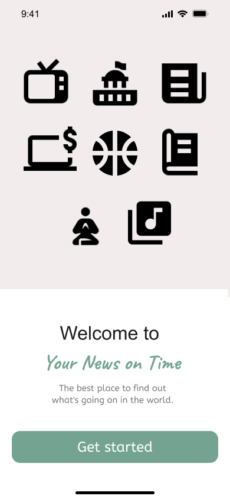
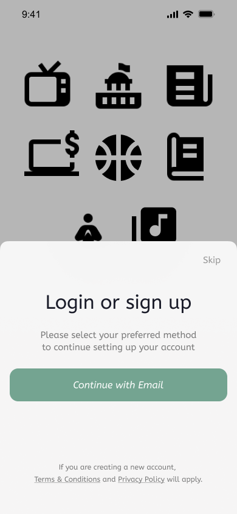
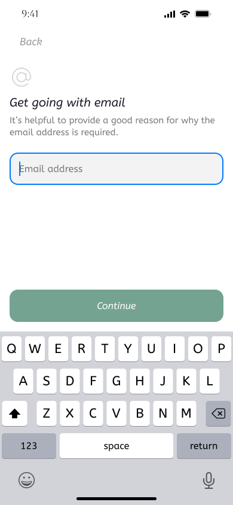
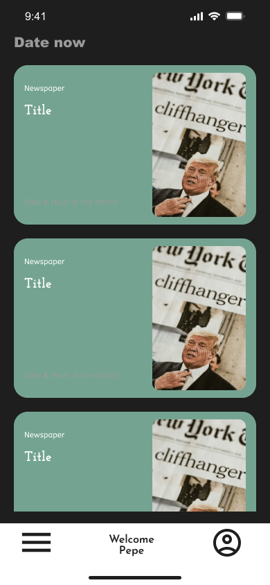
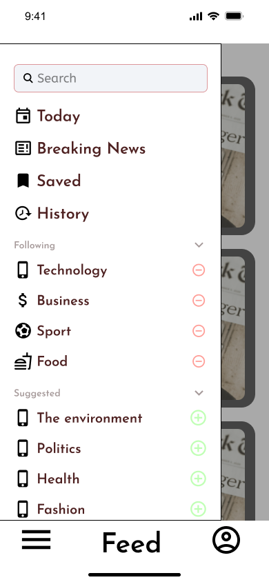

# Your News on Time

Feel free to check the website [here](#).

You can download the APK from the [releases](https://github.com/Your-News-On-Time/YourNewsonTime/releases/tag/v0.1.0-beta.1) section too.

## Project Overview

"Your News on Time" is a comprehensive news application designed to provide users with the latest news articles from various categories. The application integrates with the New York Times API to fetch and display news articles. It also includes features such as user authentication, profile management, and the ability to follow specific news categories.

## Objectives

Create a news application that allows users to access the latest news articles from the New York Times API.

## Design

The application is designed to be user-friendly and intuitive, with a clean and modern interface. The app follows the Material Design guidelines and uses a consistent color scheme and typography throughout. The navigation is simple and straightforward, with a bottom navigation bar and a navigation drawer for easy access to different screens.

### Mockups

> [!WARNING]
> The following mockups illustrate old designs of the application, because the final design was created during the development process.

1. **Welcome Screen**:
  
2. **Log in/Sign up modal**:
  
3. **Register Screen**:
  
4. **Home Screen**:
  
5. **Side Menu**:
  
6. **Article Screen**:
  

## Project Structure

The project is organized into several key components:

- **MainActivity**: The entry point of the application, responsible for initializing repositories and setting up navigation.
- **Navigation**: Manages the navigation between different screens using Jetpack Compose's `NavHostController`.
- **Screens**: Contains the various screens of the application, such as `StartScreen`, `LoginScreen`, `FeedScreen`, `ArticleScreen`, `ProfileScreen`, and `SavedScreen` (not yet implemented).
- **Components**: Reusable UI components like `PrincipalButton`, `DrawerContent`, `Footer`, and `ArticleCard`.
- **ViewModel**: Manages the UI-related data in a lifecycle-conscious way. Includes `NewYorkTimesViewModel` and `GoogleLoginViewModel`.
- **Repository**: Handles data operations. Includes `FirebaseAuthRepository`, `NewYorkTimesRepository`, and `CategoryRepository`.
- **Theme**: Defines the application's theme, including colors, typography, and shapes.

## Key Features

### User Authentication

- **Login and Registration**: Users can log in or register using email and password or Google Sign-In.
- **Anonymous Login**: Users can access the app as guests without creating an account.
- **Profile Management**: Users can view and edit their profile, including uploading a profile picture (not yet implemented) and enabling biometric authentication.

### News Feed

- **Feed Screen**: Displays a list of news articles fetched from the New York Times API. Users can navigate to detailed article views.
- **Article Screen**: Shows detailed information about a selected article, including the headline, snippet, and multimedia content.
- **Saved Articles**: Users will can save articles for later reading.

### Categories

- **Follow Categories**: Users can follow specific news categories to personalize their news feed.
- **Suggested Categories**: The app suggests categories based on user preferences.

### UI Components

- **DrawerContent**: The navigation drawer that allows users to navigate between different screens.
- **Footer**: The bottom navigation bar.
- **ArticleCard**: A card component to display individual news articles.

## Technical Details

### Dependencies

The project uses several libraries and dependencies, including:

- **Jetpack Compose**: For building the UI.
- **Firebase Authentication**: For user authentication.
- **Retrofit**: For making API calls to the New York Times API.
- **Coil**: For loading images.
- **Biometric**: For biometric authentication.

### Build Configuration

The project is configured using Gradle. Key configuration files include:

- **build.gradle.kts**: Contains the build configuration for the app module.
- **settings.gradle.kts**: Defines the project structure and repositories.
- **gradle.properties**: Contains project-wide Gradle settings.

### API Integration

The app integrates with the New York Times API to fetch news articles. The API client is configured using Retrofit, and the responses are handled by the `NewYorkTimesRepository`.

### User Interface

The UI is built using Jetpack Compose, which allows for a declarative approach to building the UI. The theme and styling are defined in the `ui.theme` package.

## Future Enhancements

1. **Save Articles**: Implement the ability to save articles for later reading.
2. **Profile Picture**: Allow users to upload a profile picture.
3. **Update User Profile Details**: Enable users to update their profile information.
4. **Push Notifications**: Implement push notifications to alert users about breaking news.
5. **Offline Mode**: Allow users to read articles offline by caching data locally.
6. **Advanced Search**: Add advanced search functionality to filter articles based on keywords, dates, and categories.
7. **Dark Mode**: Implement a dark mode theme for the app.
8. **Accessibility**: Improve accessibility by adding support for screen readers and other accessibility features.
9. **Testing**: Write unit tests and UI tests to ensure the app's reliability and stability.
10. **Performance Optimization**: Optimize the app's performance by reducing network calls and improving data loading times.
11. **Error Handling**: Implement better error handling and display meaningful error messages to users.
12. **Migration to iOS**: Develop an iOS version of the app using SwiftUI and Swift.
13. **Localization**: Add support for multiple languages and regions to make the app accessible to a global audience.

## Conclusion

"Your News on Time" is a feature-rich news application that leverages modern Android development practices and libraries. It provides a seamless user experience with its intuitive UI and robust functionality. This project serves as a comprehensive example of building a real-world application using Jetpack Compose, Firebase, and Retrofit.

## Acknowledgements

- [New York Times API](https://developer.nytimes.com/apis)
- [Firebase Authentication](https://firebase.google.com/docs/auth)
- [Jetpack Compose](https://developer.android.com/jetpack/compose)
- [Retrofit](https://square.github.io/retrofit/)
- [Coil](https://coil-kt.github.io/coil/)
- [Biometric](https://developer.android.com/jetpack/androidx/releases/biometric)

## License

This project is licensed under the MIT License - see the [LICENSE](LICENSE) file for details.

---

Crafted with ❤️ by [Juan Carlos 🤟](https://github.com/juancarlosacostaperaba) and [Nuhacet](https://github.com/nuhacet66).
